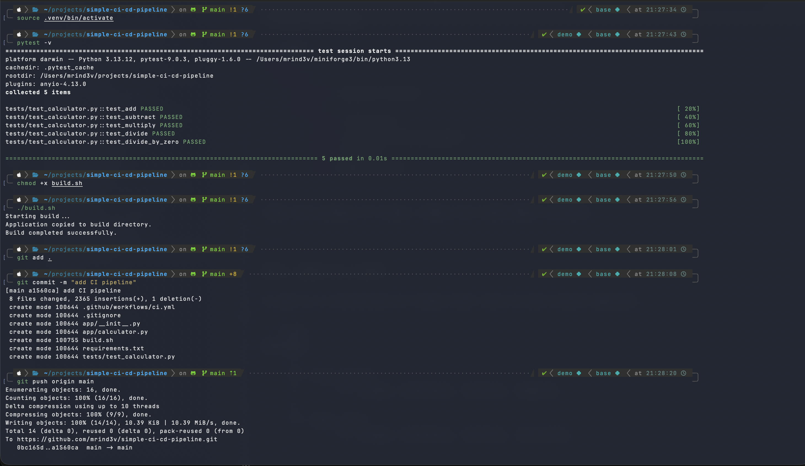
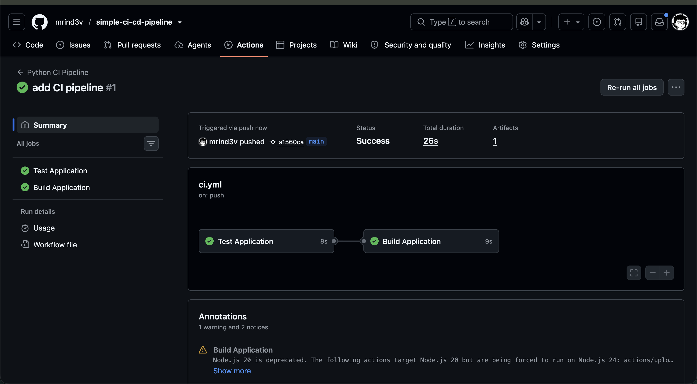
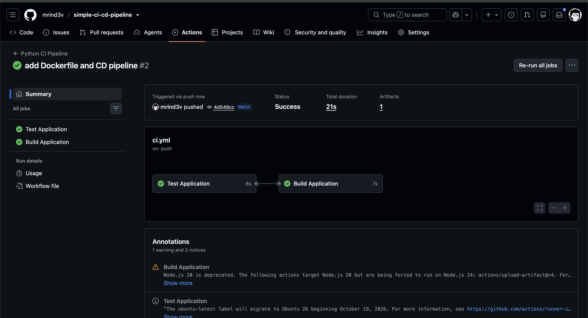

# Session 16: CI/CD & GitHub Actions – Demo Project

A small Python calculator app with a complete CI/CD pipeline on GitHub Actions.

## Project Contents

| Deliverable | Location |
|---|---|
| Application source code | `app/calculator.py` |
| Tests | `tests/test_calculator.py` |
| Build script | `build.sh` |
| Dockerfile | `Dockerfile` |
| CI pipeline | `.github/workflows/ci.yml` |
| CD pipeline | `.github/workflows/cd.yml` |

## Concepts Covered

- **CI (Continuous Integration):** every push is automatically built and tested. Here that means `pytest`, then `build.sh`.
- **CD (Continuous Delivery):** after CI passes, the app is packaged and published. Here that means a Docker image pushed to GitHub Container Registry.
- **Workflow:** a YAML file in `.github/workflows/` (`ci.yml`, `cd.yml`).
- **Jobs:** CI has two jobs, `test` and `build`. `build` uses `needs: test`, so it runs only if tests pass.
- **Steps:** the commands or actions inside a job (checkout, setup Python, install, run tests, and so on).
- **Runners:** the machines that execute jobs. Both workflows use `ubuntu-latest`, a GitHub-hosted runner.
- **Secrets:** the CD workflow logs in to the registry with `secrets.GITHUB_TOKEN`, so no password is stored in the code.
- **Artifacts:** the `build` job uploads `build/` as `calculator-build` with `actions/upload-artifact`.

---

## 1. Local test, build and push

Commands:

```bash
source .venv/bin/activate
pytest -v
chmod +x build.sh
./build.sh
git add .
git commit -m "add CI pipeline"
git push origin main
```

- `pytest -v` runs the 5 calculator tests, and all 5 pass.
- `./build.sh` copies the app into `build/` and writes `build-info.txt`.
- `git push` sends the commit to GitHub, which triggers the CI workflow.



## 2. CI pipeline execution

GitHub repository → **Actions** tab → run **#1 "add CI pipeline"**.

- The run was triggered by a push to `main`, and its status is **Success**.
- `Test Application` ran first, then `Build Application`.



## 3. Artifact

Run summary → **Artifacts** section. This is the `calculator-build` artifact uploaded by the build job.


## 4. CI after adding the Dockerfile and CD workflow

Run **#2 "add Dockerfile and CD pipeline"** also passed both jobs.



---

## CD Pipeline

`.github/workflows/cd.yml` starts automatically when `Python CI Pipeline` succeeds on `main`. It then:

1. Builds the image from the `Dockerfile`.
2. Smoke-tests the container with `10 + 5`.
3. Logs in to `ghcr.io` using `secrets.GITHUB_TOKEN`.
4. Pushes `ghcr.io/mrind3v/simple-ci-cd-pipeline:latest`.

Run the published image:

```bash
docker run -it --rm ghcr.io/mrind3v/simple-ci-cd-pipeline:latest
```
